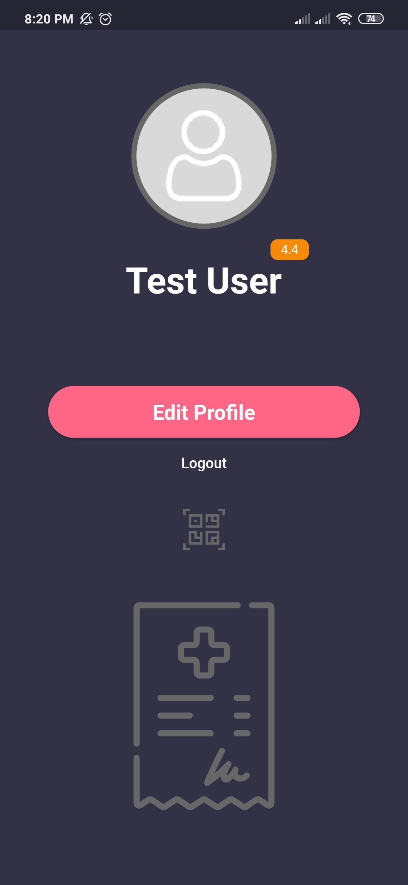
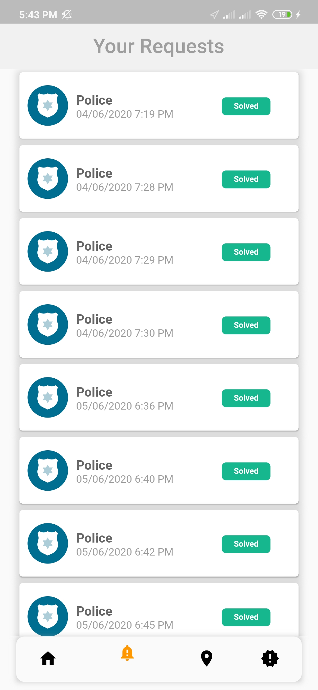
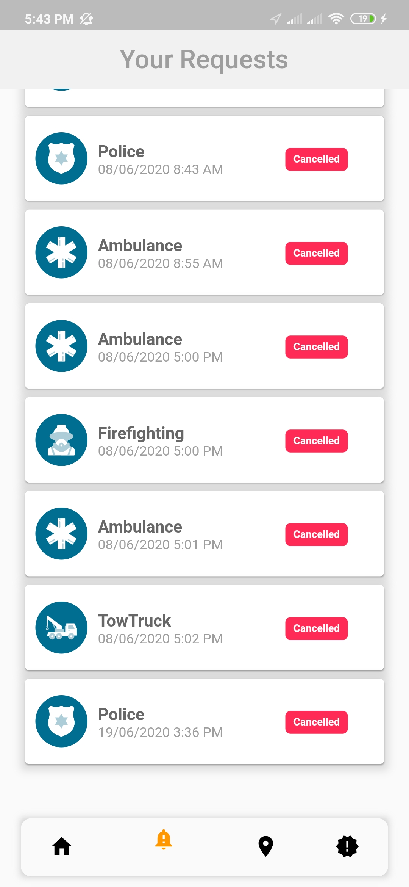
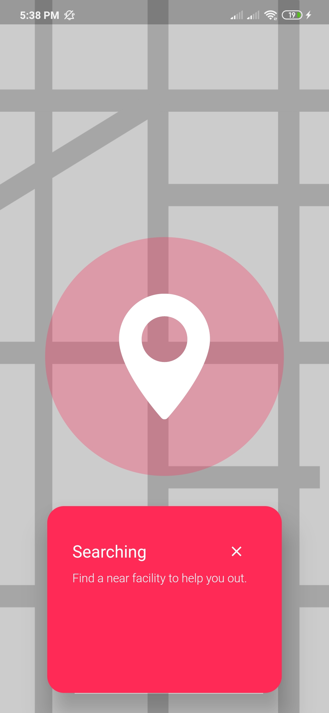
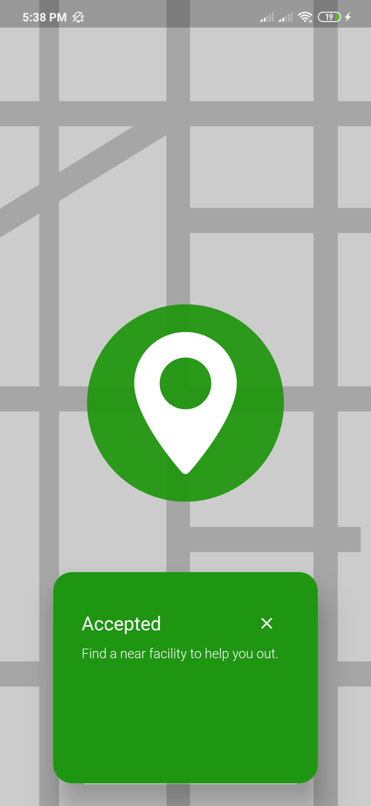
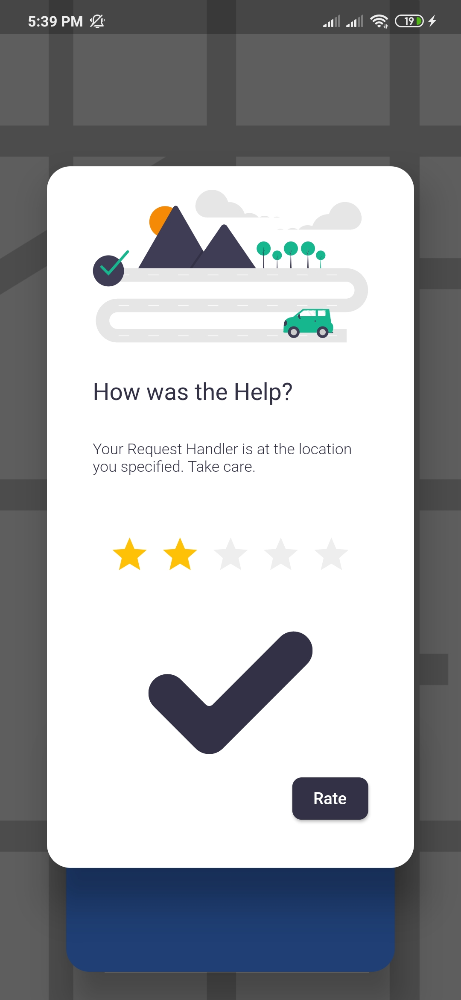
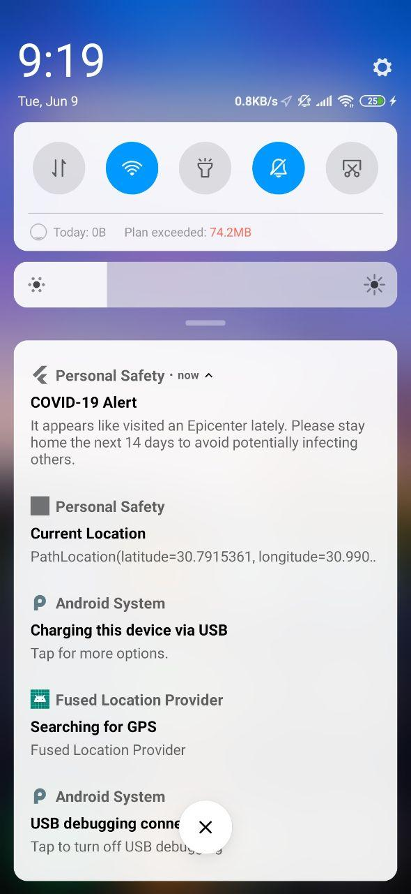

# Personal Safety

Rescuer Part :https://github.com/omarelleboudy/PersonalSafety-Rescue

Nurse Part: https://github.com/omarsaleh1997/PersonalSafety-Nurse

Backend: https://personalsafety.azurewebsites.net/

Backend Code: https://github.com/bfahm/PersonalSafety

# What this project is about:

This was the Mobile Application part our graduation project for the year 2020.

The whole project is a Location-based Emergency System, where a user makes an SOS Request or gets help from fellow users on the application.

The whole idea is to automate the current Emergency System and allow other users to help each other when possible.

# Screenshots:

                

               

                 

                 

                 

## To Install this project:

This is a Flutter Application, so Flutter is required: https://flutter.dev/docs/get-started/install

Simply clone or download this repository, open it in your IDE and get all dependencies then install it on Emulator or Real Device. This has only been tested on Android 9 devices, may not work on other versions. 

## Overview of the Application:
https://drive.google.com/file/d/1-9lXS9KV92e3gQsaFiihfchLghSE1vxO/view?usp=drivesdk

## DEMO: 
https://drive.google.com/drive/folders/100VTy1obQ40mTmfhA5b2nAV1z6b1femp?usp=sharing

